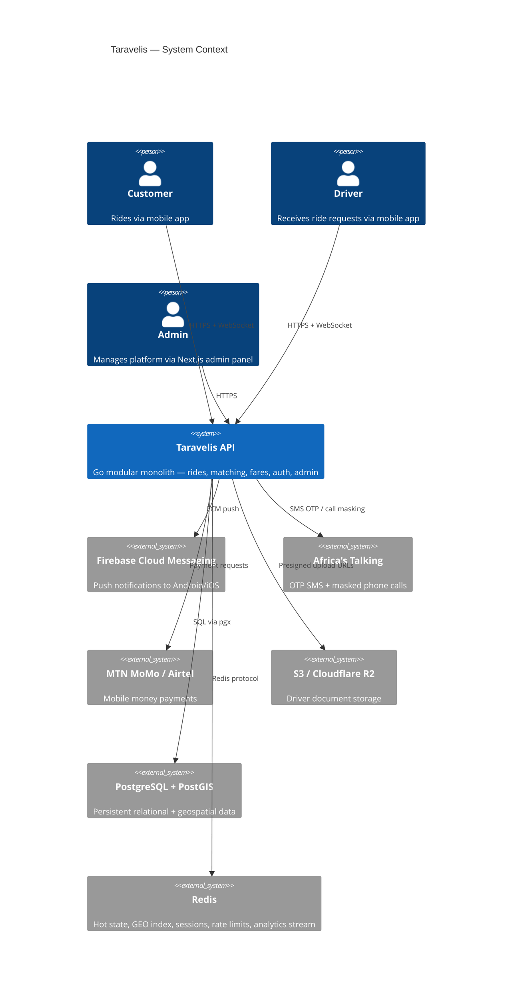
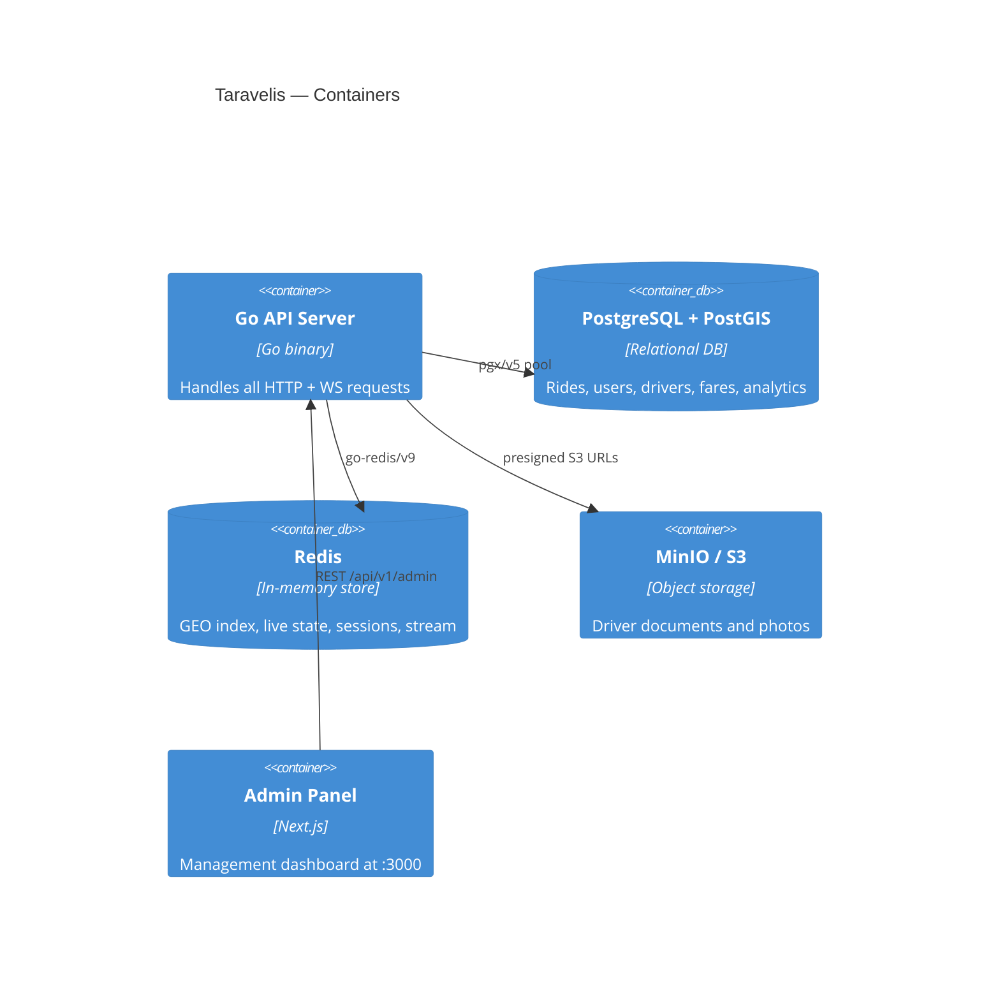
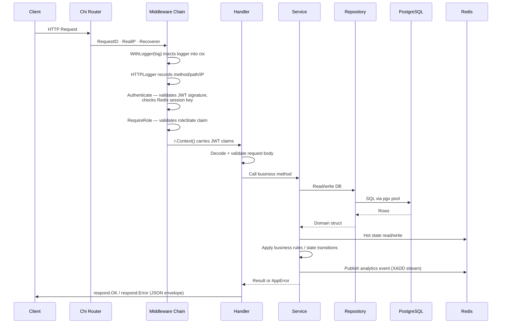
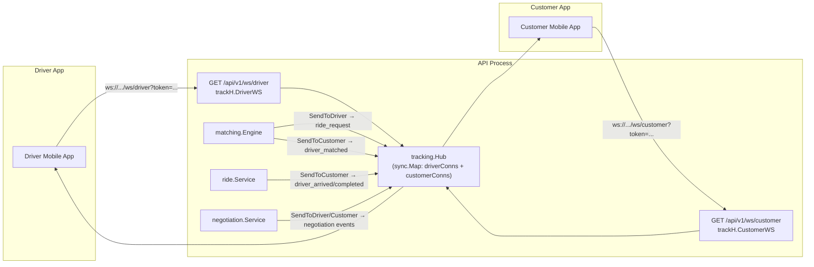
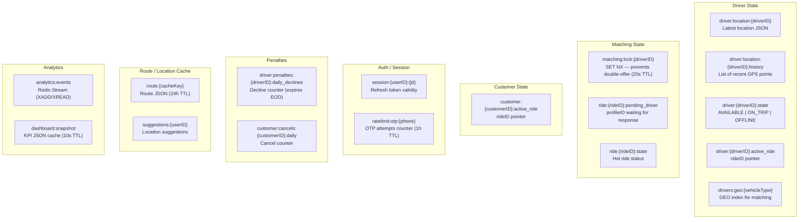
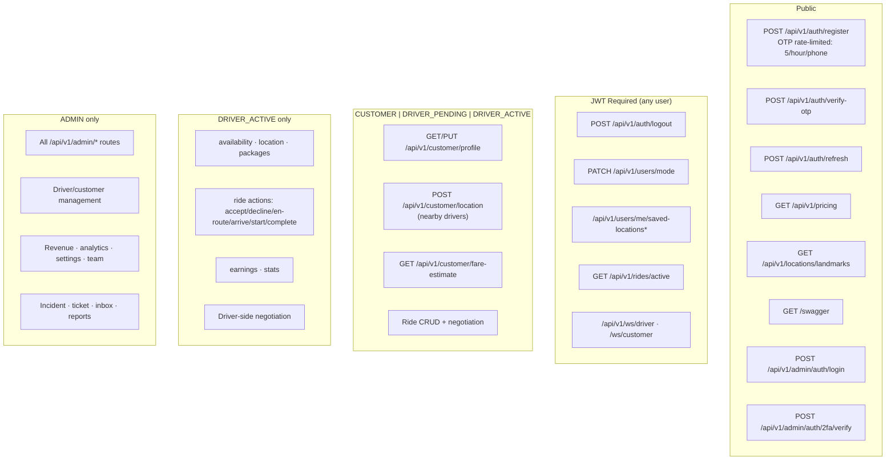

# Architecture Overview

Taravelis is a ride-hailing backend for the Rwandan market written in Go. It is a **modular monolith** — one deployable binary, cleanly divided into domain packages that each own their own handler, service, repository, and types.

---

## Technology Stack

| Layer | Technology | Notes |
|---|---|---|
| Language | Go 1.24 | Standard library + Chi router |
| HTTP Router | `go-chi/chi/v5` | Middleware-composable, context-based |
| Database | PostgreSQL + PostGIS | Geospatial queries, UUID via pgcrypto |
| Connection Pool | `jackc/pgx/v5` | 25 max / 5 min / 1 h lifetime |
| Cache / Hot State | Redis (`redis/go-redis/v9`) | GEO index, sessions, live state |
| WebSocket | `gorilla/websocket` | Driver + customer real-time tracking |
| Push Notifications | Firebase Cloud Messaging | `firebase.google.com/go/v4` |
| SMS / Masked Calls | Africa's Talking | OTP delivery, negotiation call masking |
| Payments | MTN MoMo + Airtel Money | Stub integration, TODO full API |
| Object Storage | AWS S3 / Cloudflare R2 | Driver document uploads |
| Auth | JWT (access 15 min / refresh 30 days) | `golang-jwt/jwt/v5` |
| 2FA | TOTP (`pquerna/otp`) | Admin accounts only |
| Migrations | `golang-migrate/migrate/v4` | `file://migrations`, auto-run on boot |
| Logging | `rs/zerolog` | JSON in prod, pretty console in dev |
| Config | `joho/godotenv` + env vars | Required: DATABASE_URL, JWT secrets |
| Password Hash | `golang.org/x/crypto/bcrypt` | OTP codes, admin passwords |

---

## System Context



---

## Container Diagram



---

## Module Map

```mermaid
graph TD
  subgraph cmd
    MAIN["cmd/server/main.go<br/>Wiring · Router · Migration · Lifecycle"]
    SEED["cmd/seed-admin/main.go<br/>First super-admin CLI"]
  end

  subgraph config
    CFG["config/config.go<br/>Env-driven runtime config"]
  end

  subgraph middleware
    AUTH_MW["middleware/auth.go<br/>JWT validate + Redis session check"]
    ROLE_MW["middleware/role.go<br/>Role guard (CUSTOMER/DRIVER/ADMIN)"]
    RL_MW["middleware/ratelimit.go<br/>OTP rate limit + IP rate limit"]
    LOG_MW["middleware/logger.go<br/>Request/response logging"]
  end

  subgraph "Domain Modules (Handler → Service → Repository)"
    AUTH["auth<br/>OTP · JWT · sessions · device collision"]
    CUSTOMER["customer<br/>Profile"]
    DRIVER["driver<br/>Application · docs · GPS · availability · stats"]
    RIDE["ride<br/>State machine · lifecycle · cancellation"]
    MATCHING["matching<br/>Candidate scoring · offer loop · GEO"]
    NEG["negotiation<br/>Fare rounds · lock · call initiation"]
    FARE["fare<br/>Tiered pricing · estimate · history"]
    LOCATION["location<br/>Saved places · landmarks · route cache"]
    TRACKING["tracking<br/>WebSocket hub · driver/customer WS"]
    NOTIFY["notification<br/>FCM push via Firebase"]
    PAYMENT["payment<br/>MoMo stub"]
    ANALYTICS["analytics<br/>Event publish + Redis stream consumer"]
    ADMIN["admin<br/>Approve/suspend · live rides · revenue"]
    DASHBOARD["dashboard<br/>Live KPI snapshot + polling cache"]
    PACKAGES["packages<br/>Ride credit system · free trial"]
    INCIDENTS["incidents<br/>Safety incident lifecycle"]
    TICKETS["tickets<br/>Support ticket threads"]
    INBOX["inbox<br/>External message management"]
    REPORTS["reports<br/>Generated + scheduled reports"]
    SETTINGS["settings<br/>Platform config (commission, fares, regions)"]
    TEAM["team<br/>Admin accounts · 2FA · roles · RBAC"]
    TELEPHONY["telephony<br/>Africa's Talking SMS + masking"]
    UPLOAD["upload<br/>S3/R2 presigned URL"]
  end

  subgraph pkg
    PKG_ERR["pkg/errors<br/>Typed AppError"]
    PKG_RES["pkg/respond<br/>JSON envelope helpers"]
    PKG_GEO["pkg/geo<br/>Point · Haversine · SpeedKMH"]
    PKG_LOG["pkg/logger<br/>zerolog initializer"]
    PKG_PG["pkg/postgres<br/>pgx pool factory"]
    PKG_RDB["pkg/redis<br/>Client factory + key constants"]
  end

  MAIN --> AUTH
  MAIN --> DRIVER
  MAIN --> RIDE
  MAIN --> MATCHING
  MAIN --> NEG
  MAIN --> FARE
  MAIN --> LOCATION
  MAIN --> TRACKING
  MAIN --> ANALYTICS
  MAIN --> ADMIN
  MAIN --> PACKAGES
  MAIN --> TEAM
  MATCHING --> RIDE
  MATCHING --> TRACKING
  RIDE --> TRACKING
  RIDE --> NOTIFY
  NEG --> TRACKING
  NEG --> TELEPHONY
```



---

## Dependency Wiring (Startup Order)

`cmd/server/main.go` wires the entire dependency graph. Here is the order:

```
1. Load config
2. Connect PostgreSQL pool (pgpkg.New)
3. Connect Redis client (rdpkg.New)
4. Run database migrations (golang-migrate, auto on boot)
5. Instantiate leaf services: telephony, notification, payment, analytics
6. Instantiate repositories: auth, customer, driver, ride, negotiation, fare, packages,
                              incidents, tickets, inbox, reports, settings, team
7. Instantiate WebSocket hub: tracking.NewHub
8. Instantiate domain services:
   - auth.NewService(authRepo, rdb, telSvc, cfg, log)
   - driver.NewService(driverRepo, rdb, anaSvc, cfg, log)
   - packages.NewService(pkgRepo, log)
   - ride.NewService(rideRepo, rdb, notifySvc, anaSvc, hub, cfg, log)
   - matching.NewEngine(rideRepo, driverRepo, rdb, notifySvc, anaSvc, hub, cfg, log, rideSvc)
   - negotiation.NewService(negRepo, rideRepo, rdb, hub, telSvc, anaSvc, cfg, log)
   rideSvc.SetFareRepository(fareRepo)   ← circular break: set after construction
   negSvc.SetFareRepository(fareRepo)
9. Instantiate admin, location, dashboard, and new-module services
10. Instantiate handlers
11. Register routes
12. rideSvc.SetMatchingEngine(engine)    ← circular break: set after routes wired
    rideSvc.SetRouteFareRecorder(locSvc)
    rideSvc.SetPackagesService(pkgSvc)
    adminSvc.SetPackagesService(pkgSvc)
13. Start background goroutines:
    - analytics.Consumer.Run (Redis stream consumer)
    - locSvc.WarmLandmarkRoutes (pre-warm route cache)
    - dashSvc.WarmCache + dashSvc.PollLoop (dashboard KPI polling)
14. Start HTTP server (port :8080)
15. Graceful shutdown on SIGINT/SIGTERM (15 s timeout)
```

---

## Request Lifecycle



---

## HTTP Response Envelope

All endpoints use the same JSON shape from `pkg/respond`:

```json
// Success
{ "data": { ... } }

// Error
{
  "error": {
    "code": "RIDE_NOT_FOUND",
    "message": "ride not found"
  }
}
```

Status codes are set on the HTTP header; they are not repeated in the body.

---

## WebSocket Architecture



**Key points:**
- JWT is passed as a query parameter `?token=...` (header auth is impractical for WebSocket upgrades).
- The hub is process-local. Horizontal scaling requires sticky sessions or a Redis pub/sub fanout.
- Driver sends location updates over the WebSocket connection; the server validates and stores them.
- `WriteTimeout` on the HTTP server is set to `0` — a global write timeout would kill long-lived WS connections mid-ride.

---

## Background Goroutines

| Goroutine | Launch location | Purpose |
|---|---|---|
| `analytics.Consumer.Run` | `main.go` | Reads from Redis Stream `analytics:events`, writes to Postgres `analytics_events` table |
| `matching.Engine.runLoop` | `rideSvc.CreateRide` → `engine.StartSearch` | Asynchronous driver search + offer loop for each new ride |
| `ride.Service` negotiation timeout | `rideSvc.StartNegotiationTimeout` | Auto-cancels ride after 5 min if still `NEGOTIATING` |
| `ride.Service` pickup expiry timer | `rideSvc.SetDriverArrived` | Sets `pickup_expired=true` after 5 min if ride still `DRIVER_ARRIVED` |
| `dashboard.Service.PollLoop` | `main.go` | Refreshes dashboard KPI cache every 10 seconds |
| `location.Service.WarmLandmarkRoutes` | `main.go` (startup) | Pre-populates Redis route cache for landmark pairs |

---

## Redis Architecture

All key patterns are defined in a single source of truth at `pkg/redis/redis.go`.



---

## PostgreSQL Connection Pool Settings

Configured in `pkg/postgres/postgres.go`:

| Setting | Value |
|---|---|
| Max connections | 25 |
| Min connections | 5 |
| Max connection lifetime | 1 hour |
| Max idle time | 5 minutes |
| Health check period | 1 minute |

---

## Configuration Reference

All settings are environment variables. Defaults are shown.

| Variable | Default | Description |
|---|---|---|
| `PORT` | `8080` | HTTP server port |
| `ENV` | `development` | `development` or `production` |
| `ADMIN_ORIGIN` | `""` | CORS allowed origin for admin frontend |
| `DATABASE_URL` | **required** | PostgreSQL connection URL |
| `REDIS_URL` | `redis://localhost:6379` | Redis connection URL |
| `JWT_ACCESS_SECRET` | **required** | Access token signing secret |
| `JWT_REFRESH_SECRET` | **required** | Refresh token signing secret |
| `JWT_ACCESS_EXPIRY_MINUTES` | `15` | Access token lifetime |
| `JWT_REFRESH_EXPIRY_DAYS` | `30` | Refresh token lifetime |
| `AT_API_KEY` | `""` | Africa's Talking API key |
| `AT_USERNAME` | `""` | Africa's Talking username |
| `AT_SENDER_ID` | `""` | SMS sender ID |
| `AT_MASKING_NUMBER` | `""` | Masked call number for negotiation |
| `FIREBASE_SERVICE_ACCOUNT_PATH` | `./firebase-service-account.json` | FCM credentials |
| `GOOGLE_MAPS_API_KEY` | `""` | Google Maps (currently unused) |
| `MOMO_API_KEY` | `""` | MTN MoMo API key |
| `MOMO_SUBSCRIPTION_KEY` | `""` | MoMo subscription key |
| `MOMO_ENVIRONMENT` | `sandbox` | `sandbox` or `production` |
| `STORAGE_PROVIDER` | `s3` | `s3` or `r2` |
| `STORAGE_BUCKET` | `""` | Bucket name |
| `STORAGE_REGION` | `auto` | Bucket region |
| `STORAGE_KEY_ID` | `""` | Access key ID |
| `STORAGE_SECRET` | `""` | Secret access key |
| `STORAGE_CDN_URL` | `""` | Public CDN base URL |
| `MATCH_RADIUS_PRIMARY_M` | `5000` | Primary search radius (unused, kept for future) |
| `MATCH_RADIUS_EXPANDED_M` | `10000` | Actual GEO search radius |
| `MATCH_TIMEOUT_SECONDS` | `15` | Per-driver offer timeout |
| `MATCH_MAX_ATTEMPTS` | `3` | Max search rounds per ride |
| `START_RIDE_RADIUS_M` | `150` | Geofence radius to allow ride start |
| `COMPLETE_RIDE_RADIUS_M` | `200` | Geofence radius to allow ride completion |
| `GPS_MAX_SPEED_KMH` | `200.0` | Speed above which a GPS point is anomalous |
| `GPS_STALE_THRESHOLD_SECONDS` | `300.0` | Skip plausibility if previous point is older |
| `DRIVER_OFFLINE_COOLDOWN_MINUTES` | `10` | Minimum time between online→offline toggles |
| `DRIVER_DECLINE_PRIORITY_THRESHOLD` | `10` | Daily declines before priority demotion |
| `DRIVER_DECLINE_AUTO_OFFLINE_THRESHOLD` | `15` | Daily declines before auto-offline |
| `DEV_AUTO_APPROVE_DRIVERS` | `false` | Skip admin approval in dev |
| `CUSTOMER_CANCEL_WARN_THRESHOLD` | `5` | Daily cancels before warning |
| `CUSTOMER_CANCEL_SUSPEND_THRESHOLD` | `8` | Daily cancels before suspension |
| `CUSTOMER_CANCEL_SUSPEND_HOURS` | `2` | Suspension duration in hours |

---

## Security Boundaries



---

## Known Architectural Constraints

| Constraint | Impact | Mitigation |
|---|---|---|
| WebSocket hub is process-local | Cross-instance WS delivery fails in multi-instance deploy | Use sticky sessions or add Redis pub/sub fanout |
| Payment integrations are stubs | No real money movement in prod | Full MoMo + Airtel API integration required |
| Google Maps API key unused | Route metrics use Haversine × 1.25 road factor | Wire Google Maps Directions API when ready |
| No database-level read replicas | All reads hit primary | Add read replica and route analytics queries |
| Admin 2FA backup codes hashed | Cannot recover backup codes after setup | User must re-setup 2FA if codes lost |
