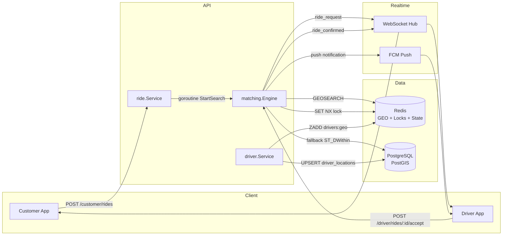
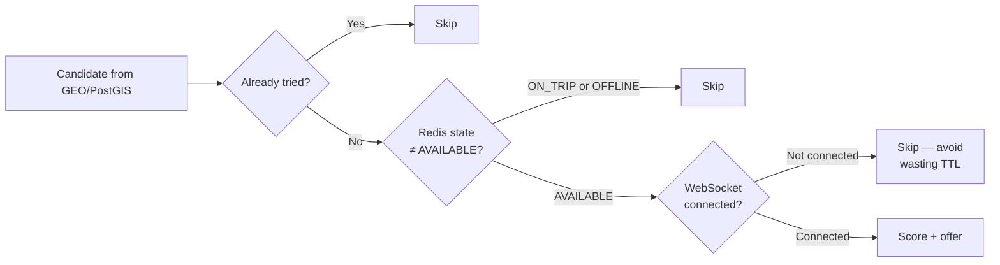
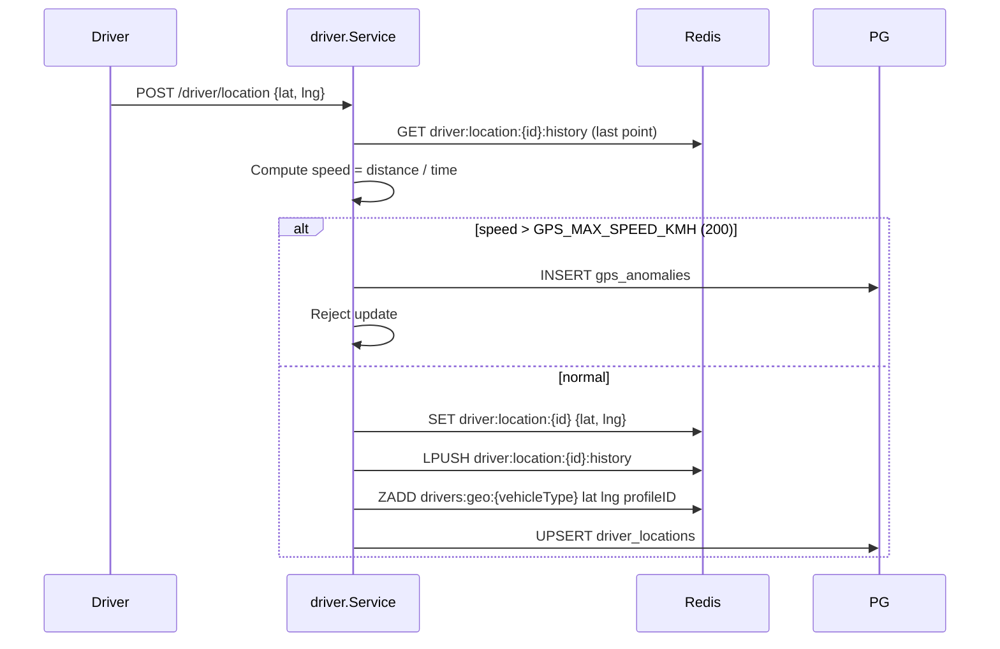
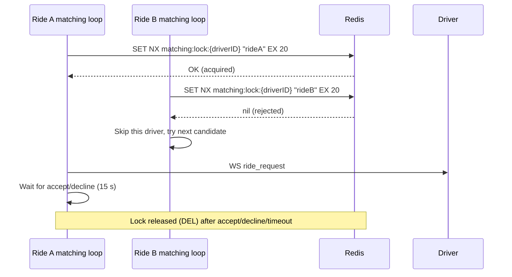
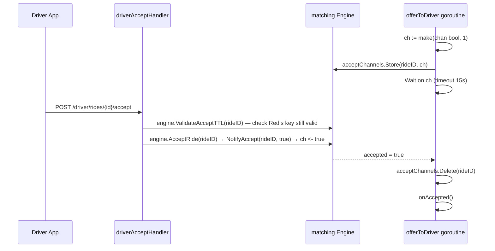
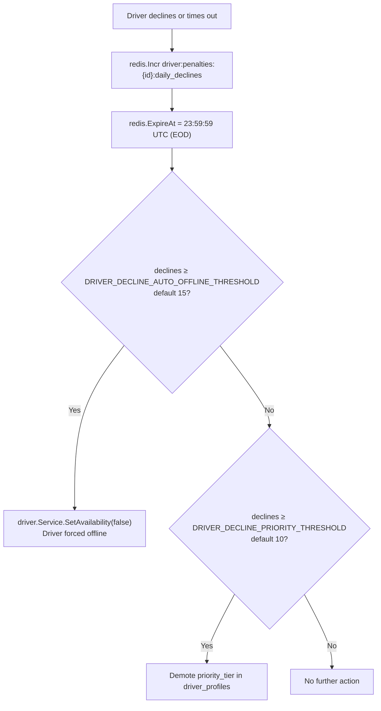

# Matching Engine

The matching engine lives in `internal/matching/engine.go`. It runs entirely asynchronously — when a ride is created, a goroutine is launched that loops until a driver is found or all attempts are exhausted.

---

## High-Level Flow



---

## Candidate Scoring

Scoring is calculated in `searchCandidates()` and `fallbackPostGIS()`. Lower score = better candidate.

### Formula

```
score = (normalized_distance × 0.60)
      + (normalized_declines  × 0.25)
      + (acceptance_penalty   × 0.15)
```

### Component Definitions

```
normalized_distance = distance_m / MATCH_RADIUS_EXPANDED_M

normalized_declines = min(today's declines, 10) / 10

acceptance_penalty  = 1.0 - (acceptance_rate / 100.0)
```

### Component Weights Explained

| Weight        | Factor          | Rationale                                                                         |
| ------------- | --------------- | --------------------------------------------------------------------------------- |
| **60%** | Distance        | Closest driver provides fastest pickup → best experience                         |
| **25%** | Daily declines  | Penalizes drivers who repeatedly decline today — avoids wasting offer slots      |
| **15%** | Acceptance rate | Long-term reliability signal; lower weight than declines (which are more current) |

### Example Score Calculation

| Driver | Distance   | Declines Today | Acceptance Rate | Score                                              |
| ------ | ---------- | -------------- | --------------- | -------------------------------------------------- |
| A      | 500 m (5%) | 0              | 95%             | 0.05×0.6 + 0×0.25 + 0.05×0.15 =**0.0375** |
| B      | 2 km (20%) | 2              | 80%             | 0.2×0.6 + 0.2×0.25 + 0.2×0.15 =**0.20**   |
| C      | 1 km (10%) | 8              | 60%             | 0.1×0.6 + 0.8×0.25 + 0.4×0.15 =**0.32**   |

Driver A wins (lowest score).

---

## Driver Eligibility Pre-filters

Before scoring, a candidate is skipped if any of these are true:



The WebSocket connectivity check (`hub.IsDriverConnected`) is a key optimization: if we offered rides to drivers without active connections, each offer would wait the full 15-second timeout before trying the next candidate, badly delaying ride matching.

---

## Redis GEO Index

The primary data source is a Redis Sorted Set used as a GEO index:

```
Key:    drivers:geo:{vehicleType}    (e.g., drivers:geo:MOTO)
Member: driverProfileID
Score:  encoded lat/lng (Redis GEO format)
```

**Written by:** `driver.Service.UpdateLocation()` — when a driver sends a GPS update and the new position differs enough from the last.

**Removed by:** `matching.Engine.onAccepted()` — driver is taken off the GEO index when assigned to a ride.

**Re-added by:** `ride.Service.CompleteRide()` — driver is re-added to the GEO index when the ride completes.



---

## PostGIS Fallback

When the Redis GEO index is empty (cold start, flush, or no drivers of that type are online), `fallbackPostGIS()` queries:

```sql
SELECT dp.id, dp.user_id, dp.transport_type, dp.acceptance_rate, dp.fcm_token,
       ST_Distance(dl.location, ST_GeographyFromText('POINT(lng lat)')) AS distance_m
FROM driver_locations dl
JOIN driver_profiles dp ON dp.id = dl.driver_id
WHERE dp.is_online = TRUE
  AND dp.approval_status = 'ACTIVE'
  AND dp.transport_type = $vehicleType
  AND ST_DWithin(dl.location, ST_GeographyFromText('POINT(lng lat)'), $radiusM)
  AND dp.id != ALL($excludedIDs)
ORDER BY distance_m
LIMIT 10
```

The same scoring formula is applied after enrichment.

---

## Offer Lock Protocol

The SET NX lock prevents race conditions where two rides try to offer the same driver simultaneously.



The lock TTL (20 s) is slightly longer than the offer timeout (15 s) to cover network latency.

---

## Accept Channel Protocol

The accept/decline mechanism uses a per-ride channel stored in a `sync.Map`:



---

## Driver Penalty Accumulation



Note: decline counters reset at midnight UTC because `ExpireAt` is set to `23:59:59 UTC` each time.

---

## No-Driver-Found Path

If `maxAttempts` (default 3) search rounds each exhaust all candidates:

1. `rideRepo.Cancel(ctx, rideID, "no driver found after max attempts", "SYSTEM")`
2. `rideRepo.AppendEvent(ride.cancelled, SYSTEM, {reason: no_driver_found})`
3. `analytics.Publish(ride.cancelled, ...)`
4. `hub.SendToCustomer(rideID, {type: "ride_cancelled", reason: "No driver found nearby. Please try again."})`

The customer sees a real-time push over their WebSocket connection and the ride is permanently `CANCELLED`.
