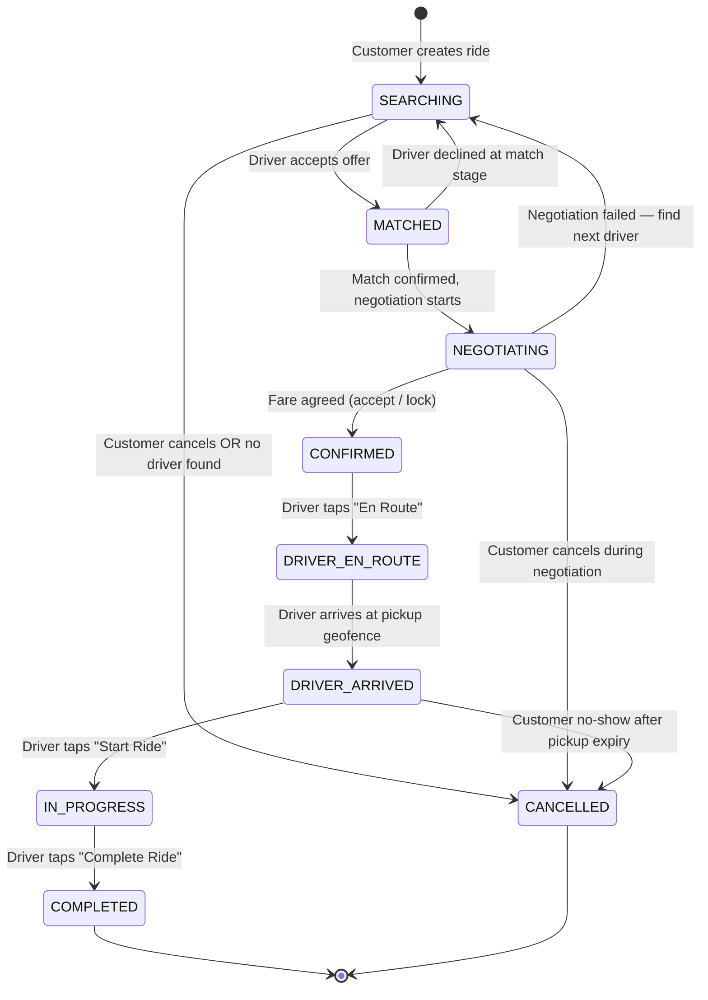
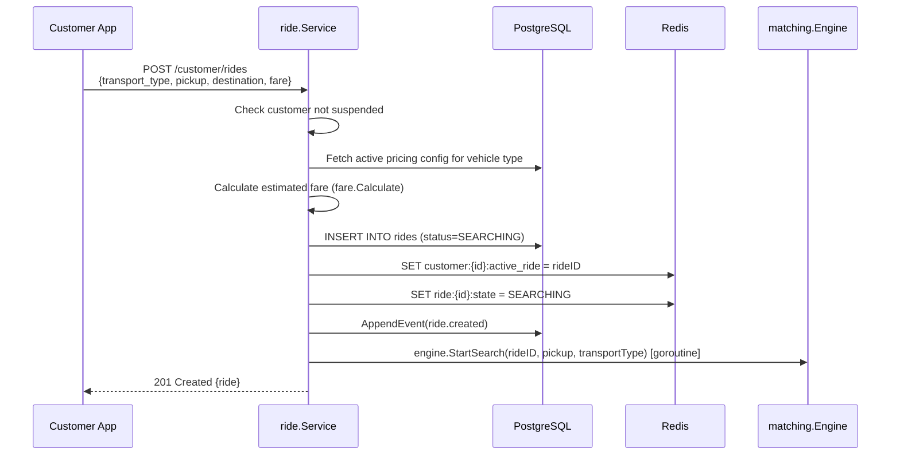
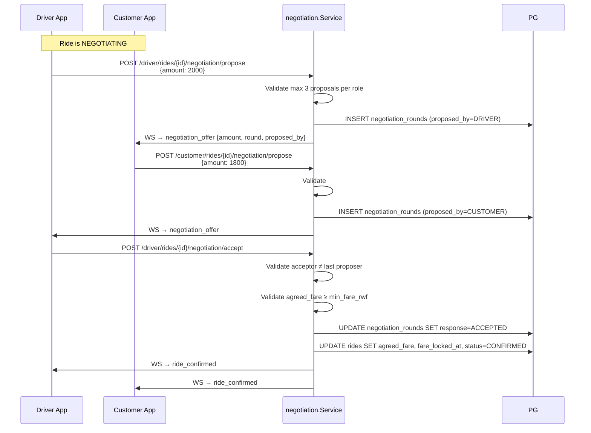
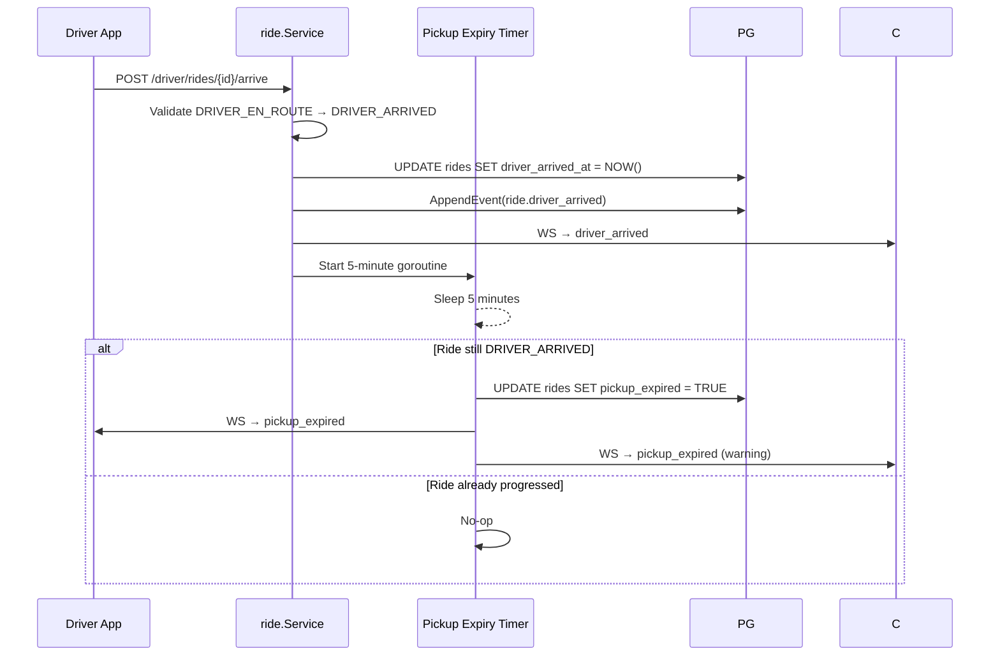
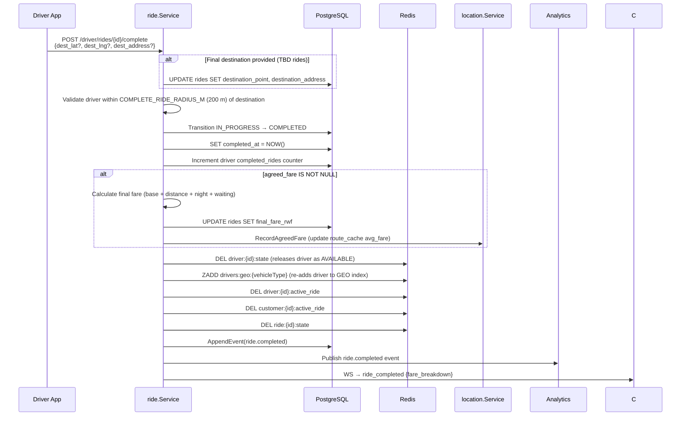
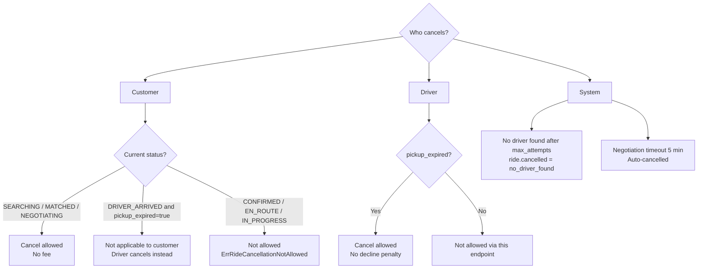
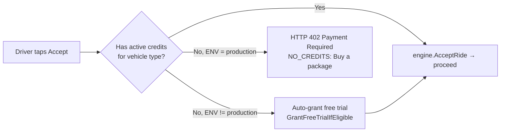
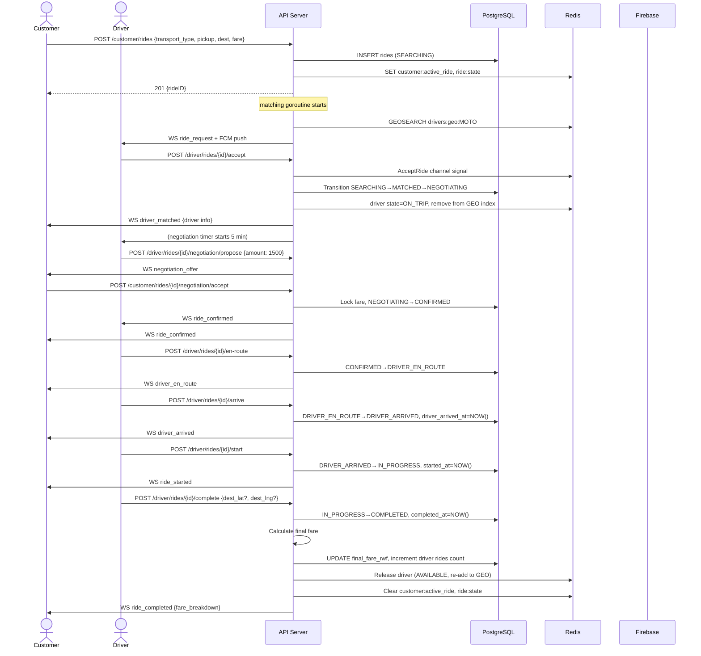

# Ride Lifecycle

This document covers the complete lifecycle of a ride — from customer request through matching, negotiation, and completion — as it is actually implemented in the code.

---

## Ride Status State Machine

Defined in `internal/ride/statemachine.go`. The `allowedTransitions` map is the **authoritative** source — any transition not listed is rejected with `ErrInvalidTransition`.



**Terminal states:** `COMPLETED`, `CANCELLED` — no outgoing transitions.

**Cancellable states (customer):** `SEARCHING`, `MATCHED`, `NEGOTIATING` only.

---

## Phase-by-Phase Breakdown

### Phase 1 — Ride Creation

**Endpoint:** `POST /api/v1/customer/rides`

**Actor:** Customer (role: `CUSTOMER_ONLY`, `DRIVER_PENDING`, or `DRIVER_ACTIVE`)



**Ride creation fields:**
- `transport_type` — matches a vehicle type code (e.g., `MOTO`, `CAB`, `HILUX`)
- `pickup_lat/lng/address` — pickup point
- `dest_lat/lng/address` — destination (can be generic/TBD)
- `customer_initial_fare` — customer's opening bid

---

### Phase 2 — Driver Matching

**Runs in a background goroutine** started by `matching.Engine.StartSearch`.

```mermaid
flowchart TD
  A[StartSearch goroutine starts] --> B{Search Redis GEO<br/>for vehicle type<br/>radius = 10 km}
  B -- Results found --> C[Enrich each candidate<br/>profile + daily declines]
  B -- Empty / Redis cold --> D[Fallback to PostGIS<br/>driver_locations table]
  D --> C
  C --> E[Score candidates]
  E --> F[Sort ascending by score<br/>lowest = best match]
  F --> G{Next unvisited<br/>candidate?}
  G -- Yes --> H{Driver has active<br/>WebSocket conn?}
  H -- No → skip --> G
  H -- Yes --> I[SET NX matching:lock:{driverID}<br/>20 s TTL]
  I -- Lock taken --> G
  I -- Lock acquired --> J[SET ride:{id}:pending_driver = profileID<br/>TTL = match timeout 15 s]
  J --> K[Send FCM push + WS ride_request to driver]
  K --> L{Wait for<br/>accept/decline<br/>up to 15 s}
  L -- Accepted --> M[onAccepted]
  L -- Declined --> N[onDeclined]
  L -- Timeout --> N
  N --> O[Increment daily_declines<br/>expires at EOD]
  O --> G
  G -- No more candidates --> P{Max attempts<br/>reached?}
  P -- No --> B
  P -- Yes --> Q[Cancel ride: no_driver_found<br/>Notify customer via WS]
```

**Scoring formula** (lower is better):

```
score = (distance_m / 10000) × 0.60
      + (min(daily_declines, 10) / 10) × 0.25
      + (1 − acceptance_rate / 100) × 0.15
```

| Weight | Factor | Meaning |
|---|---|---|
| 60% | Distance | Prefer closest driver |
| 25% | Daily declines | Penalize drivers who decline often today |
| 15% | Acceptance rate | Penalize drivers with historically low acceptance |

---

### Phase 3 — Negotiation

After a driver accepts, the ride immediately transitions: `SEARCHING → MATCHED → NEGOTIATING`. A **5-minute negotiation timer** starts.



**Negotiation rules:**
- Each side can make **at most 3 proposals**.
- An actor **cannot accept their own latest proposal** (must be the counterparty's).
- Driver can **lock a manual fare** directly without going through offer rounds (`POST /negotiation/lock-fare`).
- Driver can **initiate a masked call** via Africa's Talking (`POST /negotiation/initiate-call`) — the API returns the masked phone number.
- If still `NEGOTIATING` after **5 minutes** → ride is auto-cancelled.
- On failed negotiation (driver declines), the ride returns to `SEARCHING` to find the next driver.

---

### Phase 4 — En Route

**Endpoint:** `POST /api/v1/driver/rides/{ride_id}/en-route`

- Validates transition: `CONFIRMED → DRIVER_EN_ROUTE`
- Appends ride event: `ride.driver_en_route`
- Notifies customer via WebSocket: `driver_en_route`

---

### Phase 5 — Driver Arrived

**Endpoint:** `POST /api/v1/driver/rides/{ride_id}/arrive`



After pickup expiry, the driver may cancel without a decline penalty:
`POST /api/v1/driver/rides/{ride_id}/cancel` → validates `pickup_expired=true`.

---

### Phase 6 — Ride Started

**Endpoint:** `POST /api/v1/driver/rides/{ride_id}/start`

- Validates transition: `DRIVER_ARRIVED → IN_PROGRESS`
- Validates driver is within `START_RIDE_RADIUS_M` (150 m default) of pickup point
- Sets `started_at`
- Notifies customer via WebSocket: `ride_started`

---

### Phase 7 — Ride Completion

**Endpoint:** `POST /api/v1/driver/rides/{ride_id}/complete`



**Final fare formula:**

```
billable_km = distance_km - base_distance_km     (base distance is included in base fare)
dist_charge = billable_km × tier1_per_km_rwf       (Tier 1, up to tier1_max_km)
            + excess_km × tier2_per_km_rwf           (Tier 2 beyond tier1_max_km)
subtotal    = base_fare + dist_charge
night_charge= subtotal × night_surcharge_pct        (if time is in [night_start_hour, night_end_hour])
subtotal   += night_charge
subtotal    = max(subtotal, min_fare_rwf)
waiting_charge = (waiting_seconds - free_waiting_seconds) / 60 × waiting_rwf_per_min
total_fare  = subtotal + waiting_charge
```

---

### Cancellation Rules



**Cancellation fee logic** (in `fare.CancellationFee`):
- Fee is charged **only** if `driver_arrived_at IS NOT NULL` (driver already arrived).
- Fee amount comes from the active pricing config's `cancellation_fee_rwf`.
- Driver cancel after pickup expiry → **no decline penalty** recorded.

---

## Credit Gating (Package System)

Before a driver can **accept** a ride, the `driverAcceptHandler` checks:



Credits are tracked in `driver_ride_credits`. Each ride deducts one credit. Free trials are granted on first driver approval.

---

## WebSocket Message Types

Messages sent from server to clients during the ride lifecycle:

| Message Type | Sender | Recipients | Payload |
|---|---|---|---|
| `ride_request` | matching.Engine | Driver | rideID, pickup coords, dest coords, addresses, transport_type, suggested_fare, customer name/phone |
| `driver_matched` | matching.Engine | Customer | driverID, driver name/phone/plate, transport_type, driver lat/lng, distance_m |
| `ride_cancelled` | ride.Service / matching.Engine | Customer | reason |
| `driver_en_route` | ride.Service | Customer | rideID |
| `driver_arrived` | ride.Service | Customer | rideID |
| `pickup_expired` | ride.Service timer | Driver + Customer | rideID |
| `ride_started` | ride.Service | Customer | rideID |
| `ride_completed` | ride.Service | Customer | rideID, fare breakdown |
| `negotiation_offer` | negotiation.Service | Counterparty | rideID, amount, round, proposed_by |
| `ride_confirmed` | negotiation.Service | Driver + Customer | rideID, agreed_fare, manual (bool) |

---

## Ride Events (Audit Log)

Every status change appends a row to `ride_events`. Events are append-only and never deleted.

| Event | Actor | Trigger |
|---|---|---|
| `ride.created` | CUSTOMER | Ride creation |
| `ride.request_sent` | SYSTEM | Offer sent to a driver candidate |
| `ride.matched` | DRIVER | Driver accepted |
| `ride.negotiation_started` | SYSTEM | Immediately after match |
| `ride.fare_proposed` | CUSTOMER / DRIVER | Each negotiation round |
| `ride.fare_agreed` | CUSTOMER / DRIVER | Fare accepted |
| `ride.fare_locked` | DRIVER | Manual fare lock |
| `ride.call_initiated` | DRIVER | Negotiation phone call |
| `ride.driver_en_route` | DRIVER | En-route transition |
| `ride.driver_arrived` | DRIVER | Arrival at pickup |
| `ride.started` | DRIVER | Ride started |
| `ride.completed` | DRIVER | Ride completed |
| `ride.cancelled` | CUSTOMER / DRIVER / SYSTEM | Any cancellation path |

---

## Full Happy-Path Sequence


