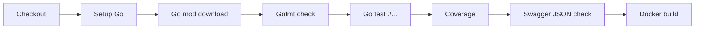

# CI/CD Plan

## Pipeline Goals

The pipeline should prove:

- Code compiles.
- Tests pass.
- Swagger JSON is valid.
- Docker image builds.
- Migrations are present and ordered.
- Deployment can be promoted safely.

## Recommended Branch Flow

```text
feature branch -> pull request -> CI -> review -> main -> staging deploy -> production promotion
```

## CI Pipeline

Suggested jobs:



## GitHub Actions Example

```yaml
name: api-ci

on:
  pull_request:
  push:
    branches: [main]

jobs:
  test:
    runs-on: ubuntu-latest
    defaults:
      run:
        working-directory: artifacts/api-server
    steps:
      - uses: actions/checkout@v4
      - uses: actions/setup-go@v5
        with:
          go-version: "1.22"
          cache-dependency-path: artifacts/api-server/go.sum
      - run: go mod download
      - run: test -z "$(gofmt -l .)"
      - run: go test ./... -coverprofile=coverage.out
      - run: go tool cover -func=coverage.out | tail -n 1
      - run: jq empty config/openapi.json
      - run: docker build -t rides-api:${{ github.sha }} .
```

## CD Pipeline

Staging:

1. Build image.
2. Push image.
3. Deploy image to staging.
4. Run migrations.
5. Run smoke tests.
6. Keep staging release notes.

Production:

1. Manual approval.
2. Promote same image from staging.
3. Run migrations.
4. Run smoke tests.
5. Monitor logs and metrics.

## Required CI Checks

| Check | Command |
|---|---|
| Format | `test -z "$(gofmt -l .)"` |
| Tests | `go test ./...` |
| Coverage | `go test ./... -coverprofile=coverage.out` |
| Swagger | `jq empty config/openapi.json` |
| Docker | `docker build -t rides-api .` |

## Secrets

Never commit:

- `.env`
- Firebase service account JSON.
- Provider API keys.
- JWT secrets.
- Database URLs.
- Redis URLs.

Store in:

- GitHub Actions encrypted secrets.
- Cloud provider secret manager.
- Runtime environment variables.

## Deployment Artifacts

Each release should produce:

- Docker image tag.
- Git commit SHA.
- Migration version.
- Release notes.
- Smoke test result.

## Rollback

Rollback should use image tags:

```text
rides-api:previous-sha
```

Keep at least the last 5 deployable images.

## CI/CD Task List

- [ ] Add GitHub Actions CI.
- [ ] Add Docker image push to registry.
- [ ] Add staging deploy.
- [ ] Add manual production approval.
- [ ] Add smoke test job after deploy.
- [ ] Add migration validation job.
- [ ] Add coverage threshold once tests improve.
- [ ] Add secret scanning.
- [ ] Add dependency vulnerability scanning.
