# Diagrams

All diagrams are written in Mermaid so they can render in GitHub, many IDE previews, and documentation platforms.

## 1. System Context

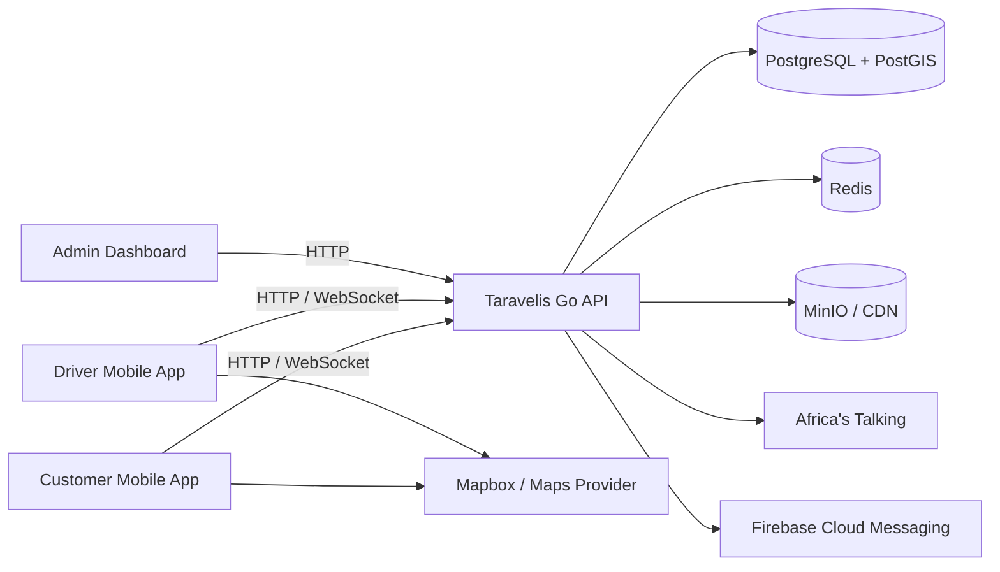

## 2. Container Diagram

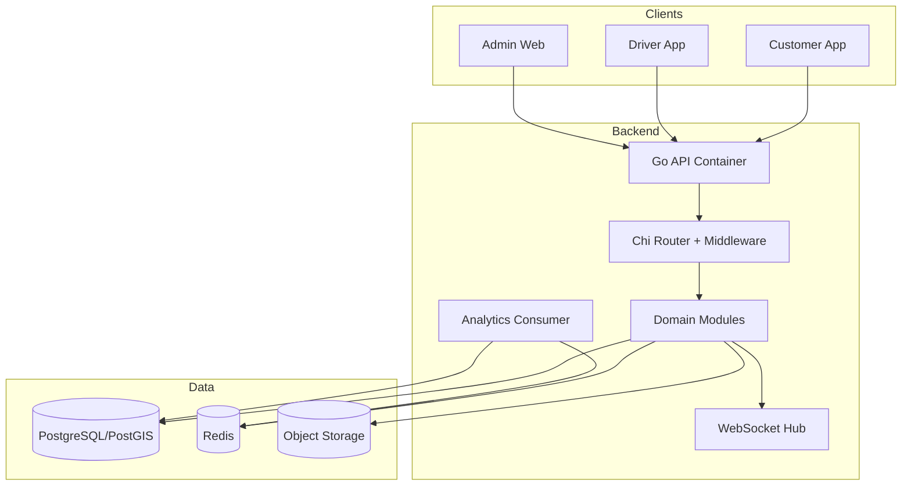

## 3. Backend Component Diagram

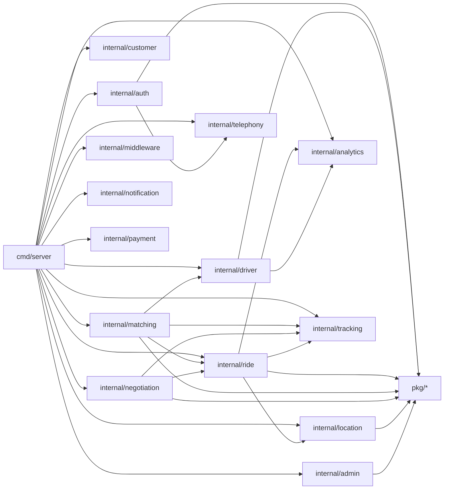

## 4. Class Diagram

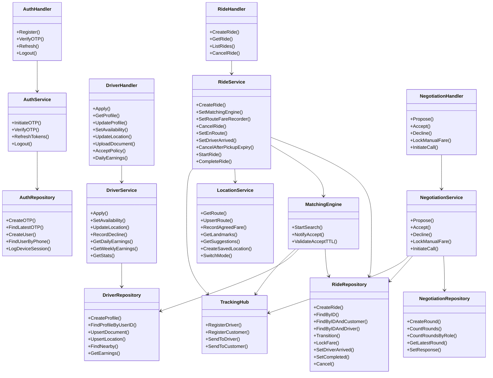

## 5. ERD

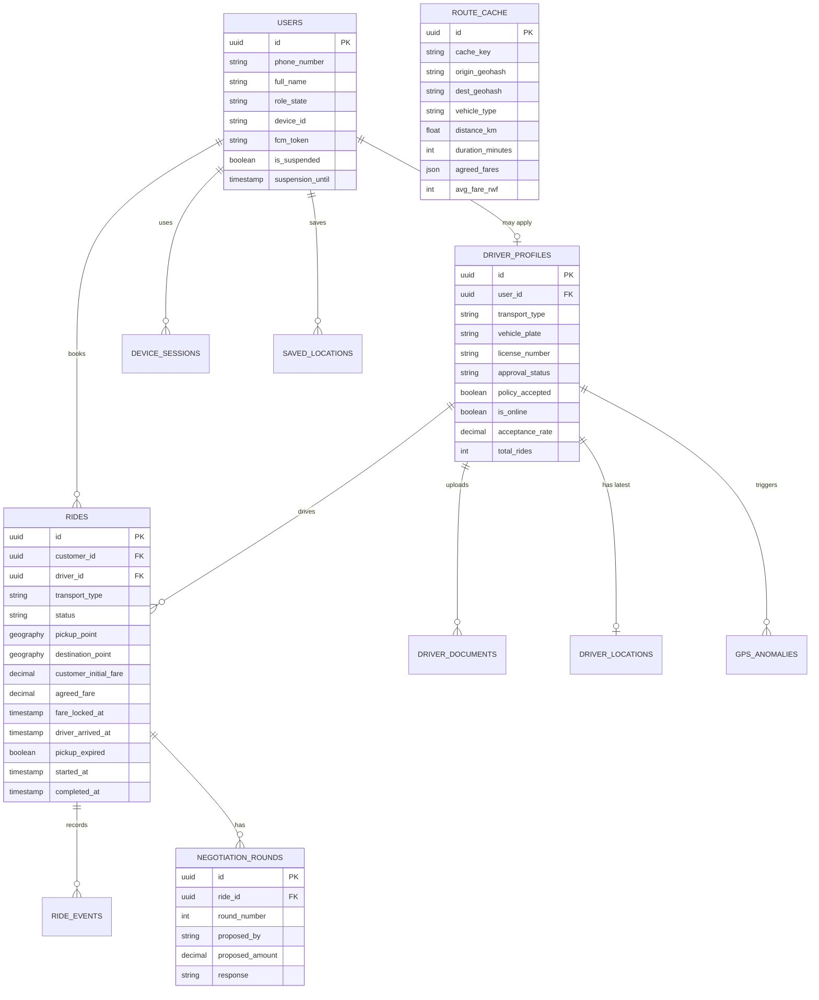

## 6. Customer Use Case Diagram

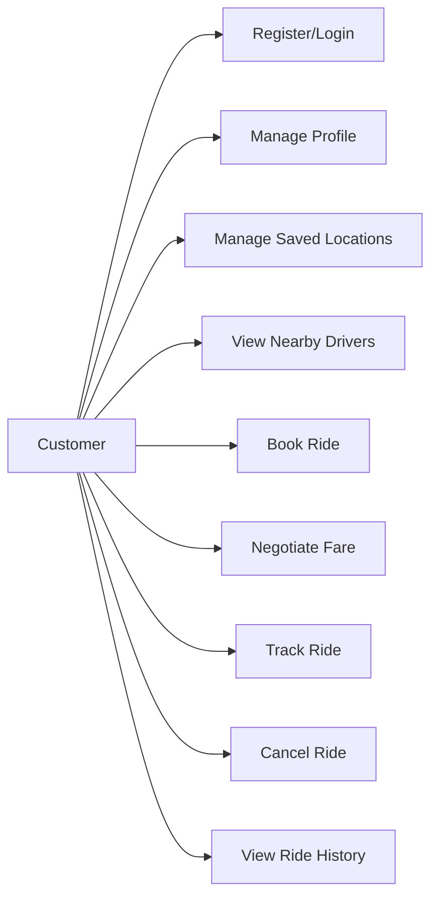

## 7. Driver Use Case Diagram

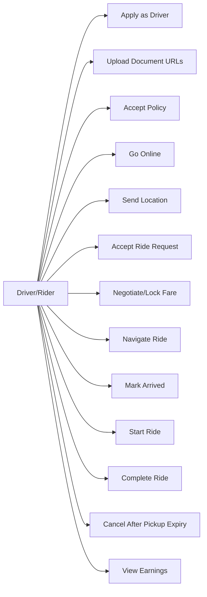

## 8. Customer Ride Sequence

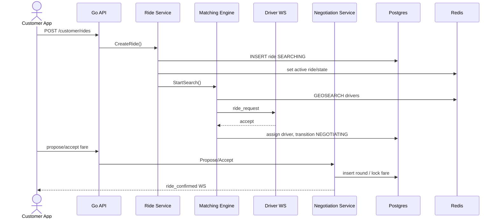

## 9. Driver Journey Activity

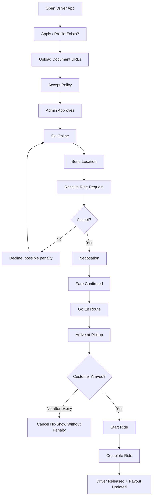

## 10. Ride State Diagram

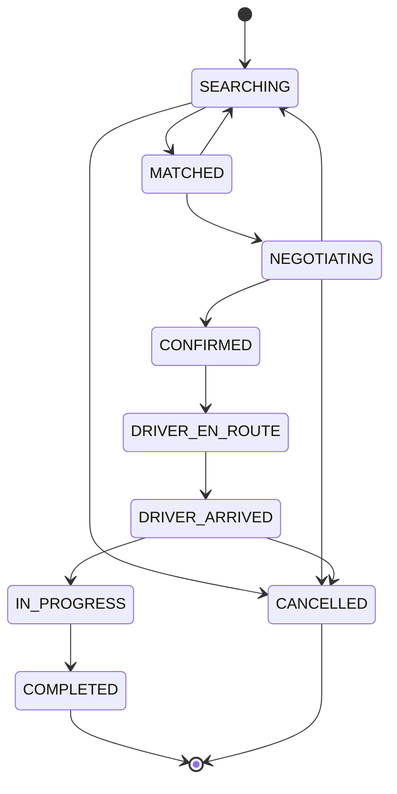

## 11. Deployment Diagram

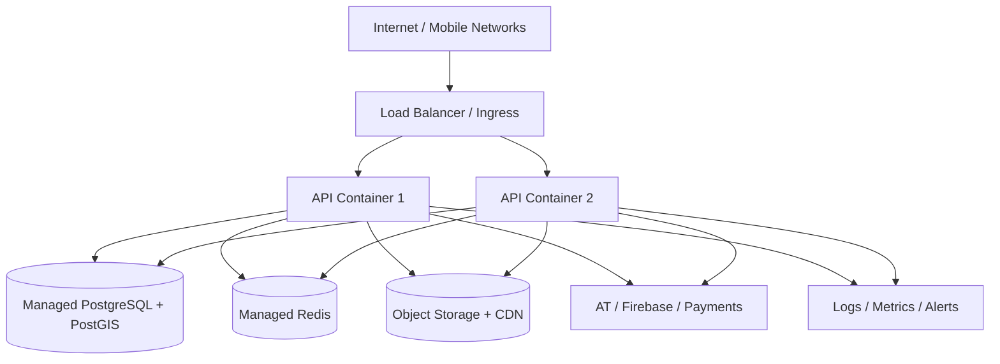
